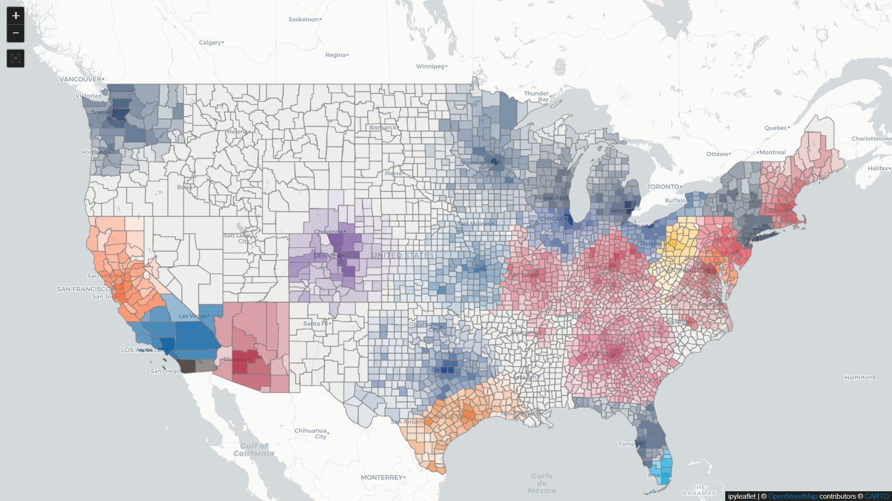
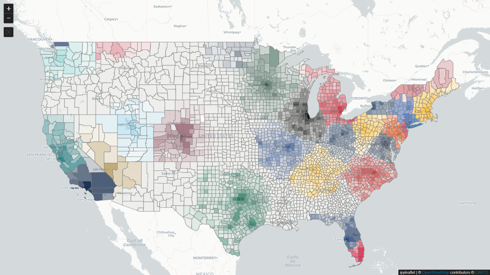

## FandomMM (Fandom Map Model) 

This project applies a mathematical model to U.S. counties to estimate the level of fan support for professional sports teams. It is inspired by several Tableau maps that visualize Twitter followers by county:

- https://public.tableau.com/app/profile/matt.sorenson/viz/NFLFollowerMap/NFLMap

- https://public.tableau.com/app/profile/matt.sorenson/viz/MLBFollowerMap/MLBMap

- https://public.tableau.com/app/profile/matt.sorenson/viz/NBAFollowerMap/NBAMap

- https://public.tableau.com/app/profile/matt.sorenson/viz/NHLFollowerMap/NHLMap

- https://public.tableau.com/app/profile/matt.sorenson/viz/MLSFanMap/MLSMap

These visualizations rely on Twitter followers, which often provide small sample sizes at the county level.

This model considers everyone a potential fan. There is a secondary "value" assigned to a county based on its distance from the venue that provide an multiplier to indicate the value the population of that county has to the team. A fan is a distant county is less likely to attend game(s) in person, but could buy a merchandise and other things. That multiplier might be something like 20% for a county 200 miles from the venue. Median income is taken into account where wealthier areas are more likely spend money supporting teams. 

This "population value" is not a specific dollar amount but should be interpreted relative to each other. 

#### Examples of MLB and NHL Heat Maps

This started as a Jupyter notebook and turned into an exercise in scaling and distribution. 

Juypter notebooks were at first an exercise to implement the idea and sharpen my Python skills. Being able to host notebooks using the Voila library was worked very well as long as someone downloads the Docker image and runs it locally and preferrably a Linux machine. In theory it should work on a Windows and Mac/OS but users have to be tech savvy in all of these situations.

I want feedback from sports fans and people who like to speculate on such things. Those people are not necessarily techically inclined so I decided to just host the Voila application somewhere.

I eventually hosted it on an inexpensive Amazon EC2 instance. Using Python for the computation meant that one user can bring the instance to its knees running four notebooks at the same time. It wasn't ready for public consumption.

There was optimizations done to the Python code that speed things up but after attending a Python meetup on [PyO3](https://pyo3.rs), the obvious next step was Rust!

Writing the computations in Rust sped things up immenselessly, but I still dissatified that I was burning my free AWS credits on a idling EC2 instance. So the next step is a Rust-based computation as a REST endpoint for an AWS Lambda and with a React client.

- [`jupyter`](./jupyter/README.md)

The original project using PyO3 to interface with the Rust computation logic.

- [`rust_calc`](./rust_calc/README.md)

At first the Lambda, PyO3 and Tauri version duplicated the core computation logic. This keeps that "DRY".

- [`axum`](./axum/README.md)

A basic Axum server to provide a REST API for the Rust computation logic and can serve the `react_interactive` frontend.

- [`rust_lambda`](./rust_lambda/README.md)

The Rust computation logic wrapped in a AWS Lambda accessible via REST.

- [`react_interactive`](./react_interactive/README.md)

React frontend for the Rust computation logic. Can be used with the Axum server, the AWS Lambda or a Tauri desktop application.

- [`aws-sam`](./aws-sam/README.md)

AWS Serverless Application Model for deploying Lambda zip, Gateway API configuration and React frontend.